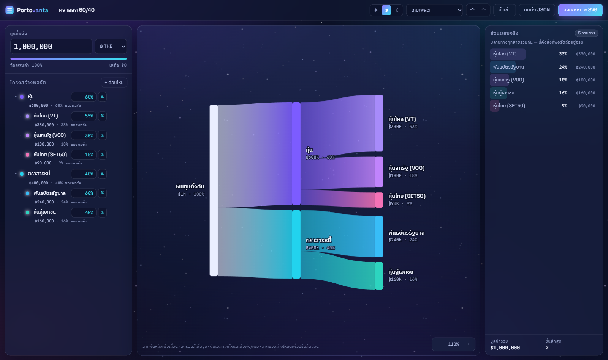
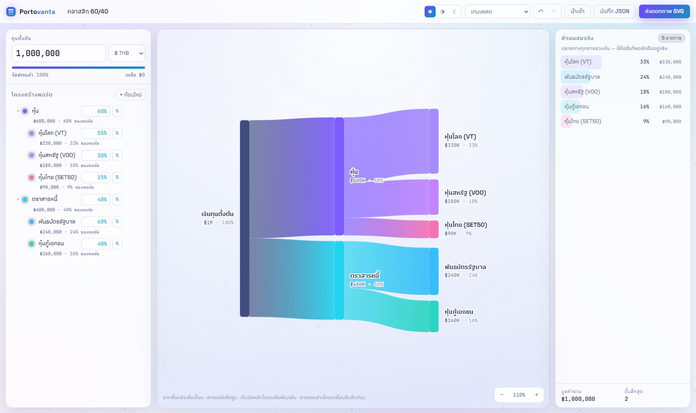

# Pansuan · ปันส่วน

จัดพอร์ตการลงทุนด้วย **Sankey Diagram** — เริ่มจากทุนตั้งต้นก้อนเดียว แล้วแตกสายออกไปเป็นสินทรัพย์ย่อยได้ไม่จำกัดชั้น
กรอกได้ทั้ง **เปอร์เซ็นต์** และ **จำนวนเงิน** ในช่องเดียวกัน แล้วแผนภาพจะไหลตามทันทีแบบ 60 fps



<sub>โทน **มืดสว่าง** — ค่าเริ่มต้นเมื่อระบบตั้งเป็นดาร์ก</sub>



<sub>โทน **สว่าง** — ค่าเริ่มต้นเมื่อระบบตั้งเป็นไลต์ · ยังมีโทน **มืด** สนิทให้เลือกด้วย</sub>

## เริ่มใช้งาน

ต้องใช้ **Node 22.12 ขึ้นไป** (ข้อกำหนดมาจาก Vite 7 — Node 20 หมดอายุซัพพอร์ตไปเมื่อเมษายน 2026)
โปรเจ็คนี้พัฒนาบน Node 24 ตามที่ระบุใน `.node-version`

`.npmrc` ตั้ง `engine-strict=true` ไว้ ดังนั้น `npm install` จะ **ปฏิเสธตรง ๆ** ถ้าเวอร์ชันไม่ถึง
แทนที่จะเตือนแล้วไปพังทีหลังในขั้น build · ข้ามครั้งเดียวได้ด้วย `npm install --engine-strict=false`

```bash
npm install
npm run dev      # http://localhost:5173
```

คำสั่งอื่น: `npm run build` (โปรดักชัน) · `npm run preview` · `npm run typecheck` · `npm run licenses`

## ฟีเจอร์

| | |
|---|---|
| **ช่องเดียว สองหน่วย** | พิมพ์ `35%` ได้เปอร์เซ็นต์ของก้อนแม่ · พิมพ์ `250k`, `1.5m`, `฿1,000`, `1ล้าน` ได้จำนวนเงิน · ตัวเลขเปล่าใช้หน่วยที่ปุ่ม `%` / `฿` ท้ายช่องแสดงอยู่ กดสลับได้โดยมูลค่าไม่เปลี่ยน |
| **ซ้อนได้ไม่จำกัดชั้น** | ทุน → กลุ่มสินทรัพย์ → หมวด → หุ้นรายตัว → ต่อได้อีก |
| **โหนดเป็นการ์ด** | ชื่อ · มูลค่า · สัดส่วนของพอร์ต อยู่ในตัวการ์ดเลย ไม่ต้องอ่านป้ายข้าง ๆ · ความสูงยังคือมูลค่าจริงเหมือนเดิม เพียงแต่ไม่เตี้ยกว่าที่ตัวหนังสือต้องการ · สีตัวอักษรเลือกเองตามความสว่างของการ์ด |
| **ริบบิ้นเรียวตามจริง** | ออกจากก้อนแม่ด้วยความหนาเท่าสัดส่วนเงินจริง แล้วบานไปเท่าความสูงการ์ดปลายทาง — ขอบที่แบกความหมายจึงอ่านถูกทั้งสองฝั่ง |
| **สีตามชั้น** | ก้อนใหม่หยิบสีจากตระกูลของชั้นตัวเอง (คอรัล → ม่วง → เทอร์ควอยซ์ → เหลืองอำพัน) คอลัมน์เดียวกันจึงอ่านเป็นกลุ่ม · เปลี่ยนเองรายก้อนได้ในพาเนลขวา |
| **ลากย้ายก้อน** | ลากโหนดไปทับอีกโหนดเพื่อย้ายไปอยู่ใต้มัน — ก้อนย่อยตามไปทั้งพวง และ **มูลค่าเงินไม่เปลี่ยน** (โหมด % จะคำนวณใหม่ให้เทียบก้อนแม่ใหม่) · ลากก้อนที่อยู่ในกลุ่มที่เลือกไว้ = ย้ายทั้งกลุ่ม |
| **ลากได้จากสองฝั่ง** | เริ่มลากจากแผนภาพหรือจากรายการ "โครงสร้างพอร์ต" ทางซ้ายก็ได้ และปล่อยลงฝั่งไหนก็ได้เหมือนกัน · ปล่อยในที่ว่างใต้รายการ = ย้ายขึ้นระดับบนสุด |
| **ก้อนติดเมาส์ตอนลาก** | ป้ายก้อนที่ลากอยู่ (สี · ชื่อ · มูลค่า) เกาะเคอร์เซอร์ไปด้วย และบอกปลายทางที่จะวาง — ก้อนแม่และลำดับที่เท่าไหร่ |
| **สลับลำดับในชั้นเดียวกัน** | ลากไปที่ **ขอบบน/ขอบล่าง** ของก้อนอื่น = แทรกก่อน/หลังในชั้นเดียวกัน · ลากทับ **กลาง** ก้อน = ย้ายเข้าไปอยู่ข้างใน |
| **แยกสองท่าให้ชัด** | ป้ายที่เมาส์บอกเป็นคนละสีคนละคำ — `↕ ลำดับที่ N ใน …` (สลับลำดับ) กับ `↳ เข้าไปอยู่ใน …` (ย้ายข้ามชั้น) · ท่าย้ายเข้าไปข้างในจะมีวงไฟขึ้นที่ก้อนปลายทางด้วย ส่วนท่าสลับลำดับดูจากช่องที่เปิดรอ |
| **เห็นก่อนวางจริง** | ระหว่างลาก ก้อนอื่นจะขยับหลบให้เห็นเลยว่าจะไปอยู่ตรงไหน — ทั้งในรายการซ้ายและบนแผนภาพ พร้อมตัวเลขที่คำนวณใหม่แล้ว · ปล่อยคือได้อย่างที่เห็น · `Esc` เพื่อยกเลิกและคืนทุกอย่างกลับที่เดิม |
| **ที่จับสำหรับลาก** | ทุกแถวในรายการซ้ายมีจุด 6 จุดอยู่หน้าสีประจำก้อน บอกว่าลากได้ · บนมือถือต้องเริ่มลากจากที่จับนี้เท่านั้น เมาส์ลากจากตรงไหนของแถวก็ได้ |
| **ปุ่มย้ายทีละขั้น** | ทุกแถวมี `↑` `↓` เลื่อนลำดับในชั้นเดิม และ `←` `→` ย้ายออก/เข้าหนึ่งชั้น — ปุ่มที่ทำไม่ได้จะจางลงเอง เหมาะเวลาต้องการความแม่นยำมากกว่าลาก |
| **เลือกหลายก้อน** | Shift+ลาก บนแผนภาพเพื่อคลุมเลือก · Ctrl/⌘+คลิก เพื่อเพิ่มทีละก้อน · Esc เพื่อยกเลิก |
| **หารเท่ากัน 3 แบบ** | เลือกหลายก้อนแล้วกดปุ่มเดียว — **หารเฉลี่ยเท่ากัน** (ยอดรวมเท่าเดิม) · **เกลี่ยยอดที่เหลือให้เท่ากัน** (ดูดส่วนที่ยังไม่ได้จัดสรรของก้อนแม่เข้ามา ก้อนที่ไม่ได้เลือกไม่ขยับ) · **หารเต็มก้อนแม่** (ใช้ยอดทั้งก้อนแม่) |
| **เห็นส่วนที่ยังไม่ได้จัดสรร** | แถบลายทแยงที่ก้นโหนดคือเงินที่ยังไม่ถูกแบ่ง (ลายเดียวกับในพาเนลส่วนผสม) · จัดสรรเกินจะขึ้นเตือนสีเหลือง |
| **ส่วนผสมจริง** | พาเนลขวารวมปลายทางทุกสายให้เห็นว่าพอร์ตถืออะไรอยู่จริงกี่ % |
| **Undo / Redo** | `Ctrl+Z` / `Ctrl+Shift+Z` — การลากหนึ่งครั้งนับเป็นหนึ่งขั้น |
| **เก็บอัตโนมัติ — ปิดได้** | บันทึกลง localStorage อัตโนมัติ · ปุ่ม **เก็บไว้ / ไม่เก็บ** บนแถบบนสุดสั่งปิดได้ และการปิด **ลบสำเนาที่เก็บไว้ทิ้งด้วย** — เปิดใหม่แล้วเริ่มจากศูนย์ ตัวเลือกนี้เองถูกจำไว้ข้ามการรีโหลด · กด **บันทึก JSON** เพื่อ export และ **นำเข้า** เพื่อกลับมาแก้ต่อ |
| **ส่งออกภาพ** | SVG พร้อมใช้ ขนาดเต็มแผนภาพ ไม่ติดปุ่มหรือ tooltip |
| **เทมเพลต** | 60/40 · All Weather · สายลุย · หรือเริ่มจากศูนย์ |
| **สามโทนสี** | **สว่าง** · **มืดสว่าง** · **มืด** — ครั้งแรกตาม `prefers-color-scheme` หลังจากนั้นจำที่เลือกไว้ · ภาพที่ export ก็ตามโทนที่เห็นบนจอ |

## คีย์ลัดและการควบคุม

| ทำอะไร | ยังไง |
|---|---|
| เลื่อนแผนภาพ | ลากพื้นหลัง (หรือคลิกกลาง) |
| ซูม | สกรอลล์ · `+` / `-` |
| พอดีจอ | `F` หรือ `0` หรือกดที่ตัวเลข % มุมขวาล่าง |
| เลื่อนแนวนอน | `Shift` + สกรอลล์ |
| **ย้ายก้อนเข้าไปในก้อนอื่น** | **ลากไปทับกลางโหนดปลายทาง** — ปลายทางจะเรืองขึ้นและก้อนจะเข้าไปอยู่ในนั้นให้เห็นก่อนเลย |
| **สลับลำดับ** | **ลากไปที่ขอบบน/ขอบล่างของโหนดอื่น** — ก้อนอื่นจะขยับหลบเปิดช่องให้ |
| **ยกเลิกการลาก** | **`Esc`** ระหว่างลาก — ทุกอย่างกลับที่เดิม (ปล่อยเมื่อไหร่ก็ได้อย่างที่เห็นตอนนั้น) |
| **เลื่อนลำดับทีละขั้น** | ปุ่ม **`↑` `↓`** บนบรรทัดมูลค่าของแต่ละแถว |
| **ย้ายเข้า/ออกหนึ่งชั้น** | ปุ่ม **`←` `→`** บนบรรทัดเดียวกัน — `→` ไปเป็นก้อนย่อยของก้อนที่อยู่เหนือมัน, `←` ออกไปอยู่ถัดจากก้อนแม่ |
| **ย้ายจากรายการซ้าย** | **ลากที่จุดสีหน้าแถว** (หรือที่ว่างในแถว) ไปปล่อยที่แถวอื่นหรือที่โหนดในแผนภาพก็ได้ · ลากค้างที่ขอบบน/ล่างของรายการเพื่อให้เลื่อนตาม |
| **ย้ายขึ้นระดับบนสุด** | **ปล่อยในกรอบว่างใต้รายการซ้าย** (โผล่ขึ้นมาตอนลาก) หรือปล่อยที่โหนดทุนตั้งต้น |
| **คลุมเลือกหลายก้อน** | **`Shift` + ลากบนพื้นหลัง** |
| **เลือกเพิ่มทีละก้อน** | **`Ctrl` / `⌘` + คลิก** (ใช้ได้ทั้งบนแผนภาพและรายการซ้าย) |
| พับ / กางก้อนที่มีลูก | ดับเบิลคลิกที่โหนด |
| เพิ่มก้อนย่อยให้โหนดปลายทาง | ดับเบิลคลิกที่โหนด |
| ปรับค่าทีละขั้น | `↑` / `↓` ในช่องค่า (`Shift` = ×10, `Alt` = ละเอียด) |
| เพิ่มก้อนย่อยจากรายการซ้าย | `Enter` ในช่องชื่อ |
| ยกเลิกการเลือก | `Esc` |

## โครงสร้างโค้ด

```
src/
├─ types.ts                 โครงข้อมูล AssetNode / Portfolio / ComputedNode
├─ lib/
│  ├─ format.ts             จัดรูปตัวเลข + parser ช่องเดียวสองหน่วย
│  └─ palette.ts            จานสีโทนอวกาศ
├─ model/
│  ├─ portfolio.ts          แก้ไขต้นไม้แบบ immutable + คำนวณเงินจริงจาก % / จำนวน
│  │                        (รวม moveNodes / equalizeSelection ที่กันวงจรและรักษามูลค่า)
│  ├─ layout.ts             เอนจิน Sankey: จัดคอลัมน์ · กันการ์ดชน · ริบบิ้นเรียวสองปลาย
│  ├─ storage.ts            localStorage · import/export JSON · export SVG
│  └─ templates.ts          พอร์ตตั้งต้นสำเร็จรูป
├─ state/
│  ├─ usePortfolio.ts       state + undo/redo + autosave
│  ├─ useNodeDrag.ts        ท่าลากย้าย/สลับลำดับท่าเดียว ใช้ร่วมกันทั้งแผนภาพและรายการซ้าย
│  │                        (ป้ายที่ติดเมาส์เขียนลง DOM ตรง ๆ ไม่ผ่าน React state)
│  ├─ useTheme.ts           สว่าง / มืดสว่าง / มืด + จำค่าที่เลือก
│  └─ viewport.ts           pan/zoom ที่ใช้ร่วมกันโดยไม่ผ่าน React state + ส่งพารัลแลกซ์ให้ดาว
├─ styles/
│  └─ themes.css            token ของทั้งสามโทน — ที่เดียวในโปรเจกต์ที่มีค่าสีดิบ
└─ components/
   ├─ SankeyCanvas.tsx      วาด SVG + อนิเมชัน + ทุก gesture
   ├─ TreePanel.tsx         ตัวแก้ไขโครงสร้างฝั่งซ้าย
   ├─ Inspector.tsx         รายละเอียดโหนด / ส่วนผสมจริง
   ├─ ValueField.tsx        ช่องกรอกที่รับทั้ง % และจำนวนเงิน
   ├─ ThemeToggle.tsx       ปุ่มสลับโทนสามระดับ
   ├─ SaveToggle.tsx        ปุ่มเปิด/ปิดการเก็บพอร์ตไว้ในเครื่อง
   └─ Starfield.tsx         พื้นหลังดาว: SVG tile + CSS ล้วน ไม่มีลูป
```

## เรื่องธีม

สีทุกจุดวิ่งผ่าน CSS custom property ดังนั้น "หนึ่งธีม" คือบล็อก token หนึ่งบล็อก —
ไม่มีกฎซ้ำ ไม่มี override รายคอมโพเนนต์ และไม่มีค่าสีดิบหลงเหลือนอก `themes.css` เลย

หัวใจคือสอง token ที่ทำงานแทนค่าฮาร์ดโค้ดเกือบทั้งหมด:

| token | คืออะไร |
|---|---|
| `--tint` | สีฝั่ง "หน้า" เขียนเป็นช่อง RGB — ใช้ทำเส้นขอบ พื้น hover เส้นคั่น |
| `--sink` | สีฝั่ง "หลัง" เขียนเป็นช่อง RGB — ใช้ทำพื้นช่องกรอกและผิวที่จมลงไป |

ที่เขียนเป็นช่องแยกกันเพราะทุกกฎจะได้เลือก alpha เองด้วย `rgb(var(--tint) / 0.08)`
โทนมืดใส่ค่าขาวลง `--tint` โทนสว่างใส่ค่าน้ำเงินเข้ม แล้วกฎเดิมทั้งหมดกลับด้านให้เองโดยไม่ต้องแก้

อีกจุดที่ตั้งใจแยก: ธีมให้แค่ **วัตถุดิบ** (`--surface-glass` กับ `--surface-solid`)
ส่วน **การเลือก** ว่าจะใช้อันไหนอยู่ใน `base.css` และ `responsive.css` ที่ specificity เท่ากัน
ถ้าปล่อยให้ธีมประกาศ `--surface` ตรง ๆ selector `:root[data-theme='light']` จะชนะ media query
ที่เป็น `:root` เฉย ๆ แล้วโหมด lite จะปิดกระจกไม่ได้ — เจอตอนเทสต์บนมือถือจริง

โทนถูกตั้งใน `index.html` ก่อนเฟรมแรก จึงไม่มีอาการวาบผิดสีตอนโหลด

## ทำไมถึงลื่นและกินทรัพยากรน้อย

หลักการเดียว: **สิ่งที่ขยับต้องไม่ผ่าน main thread** ถ้าเลี่ยงได้

- **พื้นหลังดาวไม่มีลูปเลย** — ดาวเป็น SVG tile 3 ชั้นที่วางซ้ำแบบ `background-repeat`
  ส่วนที่เคลื่อนไหวมีแค่ `transform` (ลอย) กับ `opacity` (กะพริบ) ซึ่ง compositor จัดการเอง
  พารัลแลกซ์ตอนเลื่อนแผนภาพส่งผ่าน CSS custom property สองตัวบน element เดียว
- **เรขาคณิตไม่ผ่าน React** — ตำแหน่งและความสูงของโหนดเขียนลง DOM ตรง ๆ ในลูป `requestAnimationFrame`
  โดย React ไม่แตะ attribute เหล่านั้น การรีเรนเดอร์จึงไม่ทับค่าที่กำลังอนิเมต และลูปหยุดเองเมื่อนิ่ง
- **ไฮไลต์ตอน hover ก็ไม่ผ่าน React** — สลับ class บน element ที่มีอยู่แล้ว ส่วน `<defs>` / ริบบิ้น / โหนด
  ถูก memoise ไว้กับ layout ทำให้ hover, zoom, select ไม่ต้อง reconcile SVG เป็นร้อย element
- **ไม่ใช้ `mix-blend-mode`** — screen blending บังคับให้ compositor อ่าน backdrop ใหม่ทุกริบบิ้น
  ซึ่งแพงมากบน GPU มือถือ ใช้ alpha ธรรมดาบนพื้นดำได้หน้าตาเหมือนกันโดยไม่มีต้นทุน
- **pan/zoom เก็บใน ref** ไม่ใช่ state — ลากทั้งวันก็ไม่รีเรนเดอร์สักครั้ง
- **โหมด lite อัตโนมัติ** — สคริปต์เล็ก ๆ ใน `index.html` เช็ก `deviceMemory`/`hardwareConcurrency`
  ก่อนเฟรมแรก ถ้าเครื่องไม่แรงจะปิด `backdrop-filter` (ตัวที่แพงที่สุดในหน้า) เหลือดาวชั้นเดียว
  และไม่ใช้ SVG drop-shadow — จอแคบกับ `prefers-reduced-transparency` ก็เข้าโหมดนี้เหมือนกัน
- เคารพ `prefers-reduced-motion` — ดาวหยุดนิ่ง ดาวตกหายไป ที่เหลือใช้งานได้ครบ

### วัดจริง (Chromium, จอ 120 Hz, พอร์ต 10 โหนด)

| | ก่อน | หลัง |
|---|---|---|
| JS ตอนเปิดหน้าทิ้งไว้เฉย ๆ 5 วิ | 601 เฟรม · 229.6 ms (4.6% ของเวลาจริง) | **0 เฟรม · 0 ms** |
| พิกเซล canvas ที่วาดใหม่ทุกเฟรม | 1,520,000 (≈ 3 ล้านบนจอ retina) | **0** |
| element ที่ใช้ `mix-blend-mode` | 9 | **0** |
| JS heap | 12.7 MB | **9.7 MB** |
| ลากแผนภาพ | 8.3 ms/เฟรม · แย่สุด 16.6 ms | 8.3 ms/เฟรม · แย่สุด 16.5 ms |

ตอนไม่มีใครแตะ หน้าเว็บไม่รันโค้ดเลยแม้แต่บรรทัดเดียว — ที่ยังขยับอยู่คือ compositor ล้วน ๆ
ส่วนการลากยังเท่าเดิมคือตรง vsync ทุกเฟรม

ขนาดที่ส่งจริง: JS 76.5 KB gzip · CSS 5.2 KB gzip · ฟอนต์เหลือ 4 ไฟล์ (variable font สองตระกูล)

## กติกาของการย้ายและการเฉลี่ย

สองอย่างนี้แตะตัวเลขของผู้ใช้โดยตรง เลยตั้งกติกาไว้ชัดเจน:

- **ย้ายแล้วมูลค่าเงินไม่เปลี่ยน** — ถ้าโหนดเป็นโหมด % ระบบจะคำนวณ % ใหม่ให้เทียบก้อนแม่ใหม่
  เช่น SCB = 50% ของก้อน ฿10,000 (คือ ฿5,000) พอย้ายไปใต้ก้อน ฿6,620 จะกลายเป็น 75.53% ซึ่งยังคือ ฿5,000
  เหตุผล: การลากคือ "ย้ายของ" ไม่ใช่ "ตีราคาใหม่"
- **ปล่อยให้จัดสรรเกินได้** — ย้ายของเข้าไปจนก้อนแม่เกิน 100% ระบบไม่ห้ามและไม่แอบปรับให้
  แต่จะขึ้นเตือนสีเหลืองทั้งบนโหนดและบนแถบสรุป แล้วให้ผู้ใช้ตัดสินใจเอง
- **สลับลำดับไม่แตะตัวเลข** — ย้ายภายในก้อนแม่เดิมคือเรียงใหม่เฉย ๆ ไม่มีการคำนวณ % ใหม่ให้คลาดเคลื่อน
- **พรีวิวคือของจริง** — ระหว่างลาก ระบบเอา "การย้ายที่กำลังเล็งอยู่" ไปใส่พอร์ตสำเนาแล้ววาดออกมาทั้งหน้า
  ปล่อยแล้วจึงสั่งย้ายด้วยฟังก์ชันเดียวกันเป๊ะ ๆ กับพอร์ตจริง — สิ่งที่เห็นตอนลากกับผลลัพธ์จึงเป็นอันเดียวกัน
  และพรีวิวไม่แตะประวัติ undo เลย
- **ป้ายตอบทันที รายการค่อยขยับตาม** — ป้ายที่เมาส์เปลี่ยนทันทีที่เล็งโดน แต่รายการจะจัดใหม่ก็ต่อเมื่อ
  เล็งค้างไว้ครู่หนึ่ง (~0.13 วิ) กวาดผ่านสี่แถวเพื่อไปแถวที่ห้าจึงไม่ทำให้ทั้งลิสต์กระโดดสี่รอบ
  ถ้าปล่อยระหว่างนั้นก็ได้ตามที่ป้ายบอก ไม่ใช่ตามที่ลิสต์ยังขยับไม่ทัน
- **กันวงจรตั้งแต่ตอนลาก** — โหนดปลายทางที่อยู่ใต้ตัวมันเองจะไม่ถูกเลือกเป็นปลายทาง ปล่อยแล้วไม่เกิดอะไรขึ้น
- **ลากทั้งกลุ่มได้** — ถ้าลากก้อนที่อยู่ในกลุ่มที่เลือกไว้ ทั้งกลุ่มจะย้ายตาม
  โดยตัดก้อนที่ติดไปกับก้อนแม่ของตัวเองอยู่แล้วออก จะได้ไม่โดนดึงออกมาซ้ำ
- **สามปุ่มหาร ต่างกันที่ "เอาเงินมาจากไหน"** — เรียงจากกระทบน้อยไปมาก:

  | ปุ่ม | เงินมาจากไหน | ก้อนแม่หลังกด |
  |---|---|---|
  | หารเฉลี่ยเท่ากัน | ยอดรวมของกลุ่มที่เลือกเอง | เท่าเดิม |
  | เกลี่ยยอดที่เหลือให้เท่ากัน | กลุ่มที่เลือก **+ ส่วนที่ก้อนแม่ยังไม่ได้จัดสรร** | จัดสรรครบ 100% พอดี |
  | หารเต็มก้อนแม่ | ยอดทั้งหมดของก้อนแม่ | เกิน 100% ถ้ามีก้อนที่ไม่ได้เลือก |

  ตัวอย่าง ก้อนแม่ ฿10,000 มีลูกสามก้อน ทอง ฿2,449 · Money ฿2,449 · ประกัน ฿1,000 (เหลือ ฿4,102)
  เลือกแค่ ทอง กับ Money แล้วกด **เกลี่ยยอดที่เหลือ** → ได้ก้อนละ ฿4,500 · ประกันยังเป็น ฿1,000 เท่าเดิม
  · รวมพอดี ฿10,000 ส่วน **หารเต็มก้อนแม่** จะได้ก้อนละ ฿5,000 ซึ่งทำให้ก้อนแม่เกินไป ฿1,000

  สองปุ่มหลังโผล่เฉพาะตอนที่ทุกก้อนที่เลือกอยู่ก้อนแม่เดียวกัน และปุ่มกลางจะจางลงเมื่อก้อนแม่ไม่มียอดเหลือ

ทั้งหมดนับเป็นหนึ่งขั้นของ undo

## ลิขสิทธิ์

© 2026 ICEPAJINGKO · สงวนลิขสิทธิ์ — เงื่อนไขเต็มอยู่ใน [LICENSE](LICENSE)
ชื่อเจ้าของที่แสดงในแอปอยู่ที่เดียวใน [src/lib/legal.ts](src/lib/legal.ts)
ประกาศจะแสดงท้ายพาเนลซ้าย และ **ไม่ติดไปกับภาพ SVG ที่ export** โดยตั้งใจ

แอปนี้ bundle `react` · `react-dom` · `scheduler` ซึ่งเป็น MIT License ของ Meta
MIT บังคับให้แนบประกาศลิขสิทธิ์ไปกับสำเนาที่แจกจ่าย (การ deploy ขึ้นเว็บก็นับ)
ประกาศจึงอยู่ที่ [public/third-party-notices.txt](public/third-party-notices.txt) ซึ่ง ship ไปกับ `dist/`
และมีลิงก์จากท้ายพาเนลซ้ายให้เข้าถึงได้จริงจากเว็บที่ deploy แล้ว

ไฟล์นั้นสร้างจาก dependency tree ที่ติดตั้งจริง ไม่ได้พิมพ์มือ — รันใหม่เมื่อ dependency เปลี่ยน:

```bash
npm run licenses
```

ฟอนต์ทั้งสามโหลดจาก Google Fonts ตอนรันไทม์ ไม่ได้ redistribute จึงยังไม่มีภาระ
ถ้าย้ายมา self-host ต้องแนบ OFL 1.1 ไปกับไฟล์ฟอนต์ด้วย

## หมายเหตุ

ข้อมูลทั้งหมดอยู่ในเครื่องผู้ใช้ ไม่มีเซิร์ฟเวอร์และไม่มีการส่งข้อมูลออก
ตัวเลขในเทมเพลตเป็นเพียงตัวอย่างสำหรับวางแผน ไม่ใช่คำแนะนำการลงทุน
